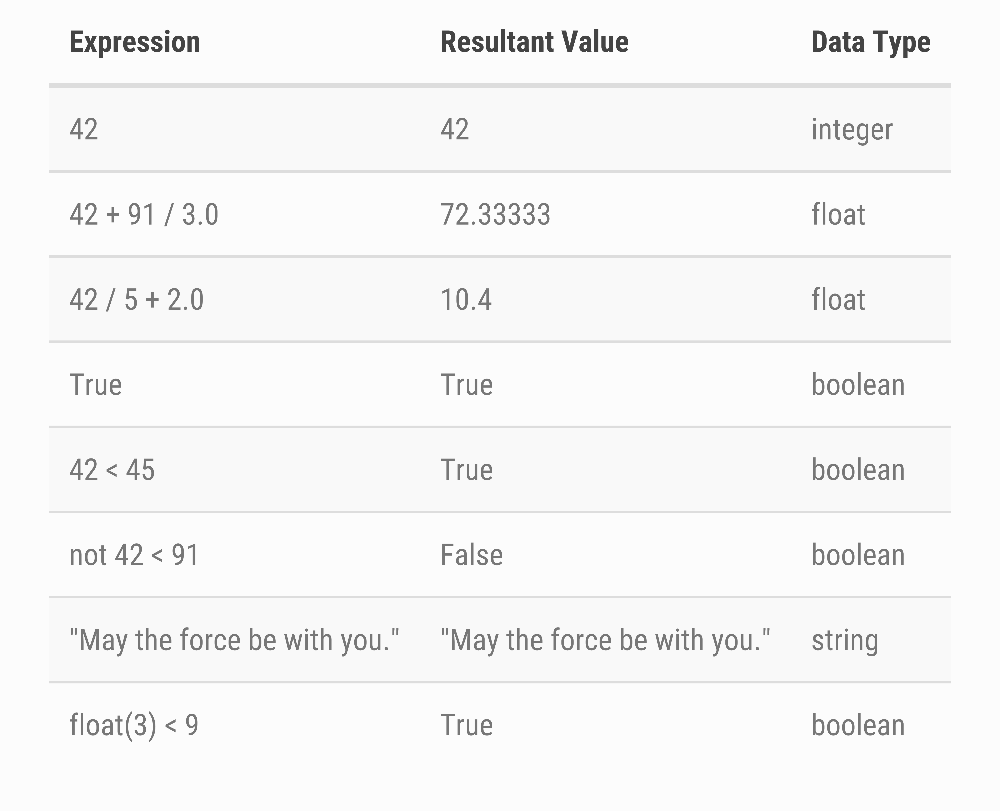
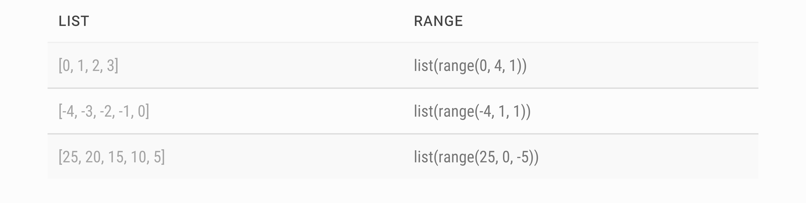
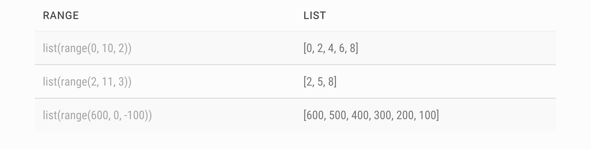

# Data Programming with Python
# Data Programming with Python


## Introduction

The goal of this tutorial is to gain more experience writing and running Python code and programs and practice printing results to match a specification.


### Data Types

For each expression, we write the resultant value and data type as shown in the below table.





### Lists + Range


For each list below, we write an equivalent call using `range()`. Similarly, for each call using range, we give the corresponding list.






-------------------------


## Loops + If Statements

In the following section, we write Python code using variables and loops to solve simple math problems.


### Problem 1

1. Compute and print both roots in ascending order of the following quadratic equation: $3x^2-5.86x+2.5408$


Here we need to use the quadratic equation to solve for the roots:


$$
\begin{align}
x &= \frac{-b\pm \sqrt{b^2 - 4ac}}{2a} \\
&= \frac{5.86 \pm \sqrt{5.86^2 - 4\cdot 3 \cdot 2.5408}}{2\cdot 3}
\end{align}
$$


```python
import math

a = 3
b = -5.86
c = 2.5408
root1 = (-b - math.sqrt((b ** 2) - (4 * a * c))) / (2 * a)
root2 = (-b + math.sqrt((b ** 2) - (4 * a * c))) / (2 * a)
print("Root 1: ", root1)  # 0.6496431
print("Root 2: ", root2)  # 1.30369
```


-------------------------


### Problem 2


2. Use a for loop to print the decimal representations of the following fractions, each on their own line: $\left(\frac{1}{2}, \frac{1}{3}, \ldots , \frac{1}{10} \right)$


```python
for denom in range(2, 11, 1):
    print("1 /", denom, ":", float(1/denom))
```


-------------------------


### Problem 3 

3. Use a for loop to compute the $10th$ triangular number. The $nth$ triangular number is calculated by $\dfrac{n(n+1)}{2}$


The following solution should correctly calculate the $11th$, $12th$, $\ldots$,  triangular number by changing the variable $n$ for any number greater than $0$.


```python
n = 10
triangular = 0
for i in range(1, n + 1):
    triangular += i
print("Triangular number", n, "via loop:", triangular)
print("Triangular number", n, "via formula:", n * (n + 1) / 2)
```


-------------------------


### Problem 4

4. Use a for loop to compute $10!$, the factorial of $10$. The factorial of a number, $n$, can be calculated by $1\cdot 2 \cdot 3 \cdot \ldots \cdot n$.


Similarly to problem 3, the following solution should be able to correctly calculate any factorial just by changing a variable.


```python
n = 10
factorial = 1
for i in range(1, n + 1):
    factorial = (factorial * i)
print(factorial)
```


-------------------------


### Problem 5

5. Print the first $10$ factorials in descending order $\left(10!, 9!,\ldots , 1!\right)$.


The first line of your solution should assign a variable num_lines to 10, and then the rest of your solution should print the correct number of lines and factorial on its own line. Similarly to problems 3 and 4, your solution should be able to work for any number just by changing num_lines.


```python
num_lines = 10
for num in range(num_lines, 0, -1):
    factorial = 1
    for i in range(1, num + 1):
        factorial = (factorial * i)
    print(factorial)
```


-------------------------


### Problem 6

6. Use a for loop to compute the following value:


Similar to problems 3 - 5, you should assign a variable to determine how many number of fractions to add. Don’t try to incorporate adding 1 into your loop as that will unnecessarily complicate your solution. Instead, add it to the result either prior or after running your for loop.

```python
fractions = 10
value = 0
for num in range(0, fractions, 1):
    factorial = 1
    for i in range(1, num + 1):
        factorial = (factorial * i)
    value += 1/factorial
print(value)  # 2.718281801
```


-------------------------

