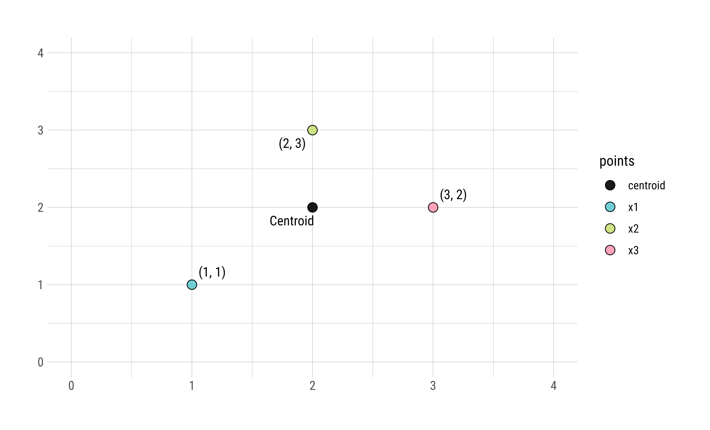

```{r setup, include=FALSE}
knitr::opts_chunk$set(echo = TRUE, warning = FALSE, message = FALSE, out.width = "80%")
library(kableExtra)
library(knitr)
library(ggplot2)
library(hrbrthemes)
library(lubridate)
library(GGally)
library(ggrepel)
library(spotifyr)
library(tidyverse)
library(shiny)
library(shinydashboard)
library(magick)
library(genius)
library(tidytext)
library(geniusr)
library(dplyr)

source('scripts/data.R')
```


<script src="assets/min.js"></script>
<script src="//cdnjs.cloudflare.com/ajax/libs/highlight.js/9.12.0/highlight.min.js"></script>
<script src="assets/pymin.js"></script>
<script>hljs.initHighlightingOnLoad();</script>


<span class = "myhighlight">Objective.</span> Using Python, the project goal is to implement a k-means clustering algorithm, a technique often used in machine learning, and use it for data analysis. We write various functions making use of lists, sets, dictionaries, sorting, and graph data structures for computational problem solving and analysis.


-----------------------------------


## Background


K-means clustering is a popular machine learning and data mining algorithm that discovers possible clusters within a dataset. Finding these clusters often reveals meaningful information from the data distribution. K-means clustering is used for a number of different applications, such as recognizing hand-written digits, which we will be implementing in this assignment.


### Algorithm Overview

<div class = "roundedlist">
K-means clustering works in four steps:

1. Initialize some number $k$ of cluster centers, also called `centroids`.
2. For each data point in the dataset, assign it to the closest centroid.
3. Update the locations of the centroids to be the average of all the points assigned to that cluster.
4. Repeat steps 2 and 3 until convergence.

</div>


Note that the actual data points do not change. Only the locations of the centroids change with each iteration. And as the centroids move, the set containing the data points closest to each centroid alters. Below is an example of a single run of the K-means clustering.


```{r,echo=FALSE,eval=TRUE}
# Step 1. Initial Centroid Placement
# Step 2. Update Assignments
# Step 3. Update Centroid Location
# 
data_points2 = data.frame(
  "points" = c("x1", "x2", "x3", "centroid"),
  "label" = c("(1, 1)", "(2, 3)", "(3, 2)", "Centroid"),
  "x" = c(1, 2, 3, 2),
  "y" = c(1, 3, 2, 2))

data_points_plot <- 
  ggplot(data = data_points2, mapping = aes(x = x, y = y, label = label)) +
  geom_point(mapping = aes(fill = points), pch = 21, size = 3.25, alpha = 0.9, color = "#030404", stroke = 0.5) +
  geom_text_repel(point.padding = 5, family = "Roboto Condensed", size = 3.75, fontface = "plain") +
  scale_fill_manual(values = c(
    "black", "#61cad1", "#cae278", "#ff99b1",
    # extra colors
    "#F0BE43", "#c757c7", "#ff5370")) +
  theme_ipsum_rc(axis_text_size = 10) + xlim(c(0, 4)) + ylim(c(0, 4)) +
  theme(axis.title.x = element_blank(), axis.title.y = element_blank())


ragg::agg_png(filename = "assets/static/data_points_plot.png", width = 7085, height = 4295, units = "px", res = 900)
data_points_plot
invisible(dev.off())

```


As with many machine learning techniques, this algorithm consists of a vast list of terminology which we define in a bit more detail below.


<span class = "myhighlight2">Definition 1. Distance</span> The Euclidean distance, which indicates a straight line, is a simple way to calculate how close a data point is to a centroid. We calculate the euclidean distance using the **Pythagorean theorem**, defined as follows. For two points $a = \left[a_1, a_2, \ldots, a_n\right]$ and $b = \left[b_1, b_2, \ldots, b_n\right]$, where $n$ is the current dimension, we define the euclidean distance between both points as 


$$
\begin{align}
\mathbf{\large\color{darkmagenta} D}(a, b) &= 
\sqrt{\left(a_1 - b_1\right)^2 + 
\left(a_2 - b_2\right)^2 + 
\ldots + \left(a_n - b_n\right)^2}
\end{align}
$$


<span class = "myhighlight2">Definition 2. Clusters</span> A cluster is a collection of points that are part of the same group. For k-means, every point is part of a cluster. So as the algorithm progresses and the centroids shift, points might change which cluster they're grouped in, even though the point itself does not move. 


<span class = "myhighlight2">Definition 3. Centroids</span> A centroid is the center of a cluster. In K-means, we assume that the centroid of a cluster is the average location of all the points in that cluster. This is equivalent to the average of the data points' components in each dimension. So if we have three $n$-dimensional points $a$, $b$, and $c$, we define the average as


$$
\mathit{average} = 
\left[
\dfrac{a_1 + b_1 + c_1}{3}, \dfrac{a_2 + b_2 + c_2}{3}, \dfrac{a_3 + b_3 + c_3}{3}
\right]
$$


<span class = "myhighlight2">Definition 4. Convergence</span> An algorithm converges if the locations of all centroids do not change much between two iterations, e.g. within some threshold of $1 \times 10^{-5}$.


-------------------------


## Part 1. The Algorithm


<span class = "myhighlight">Objective.</span> Design and implement a k-means clustering algorithm in Python.


Specifically, we write the K-means clustering algorithm in the `kmeans.py` file and then run the program on various datasets contained in a nearby directory. To implement the algorithm, we work with the data structures `data` and `centroids`.


<div class = "datasource2">
1. `data`: A list of data points, where each data point is a list of numeric float values.
2. `centroids`: A dictionary of centroids, where the keys are strings (centroid names) and the values are lists (centroid locations).
</div>


-------------------------


