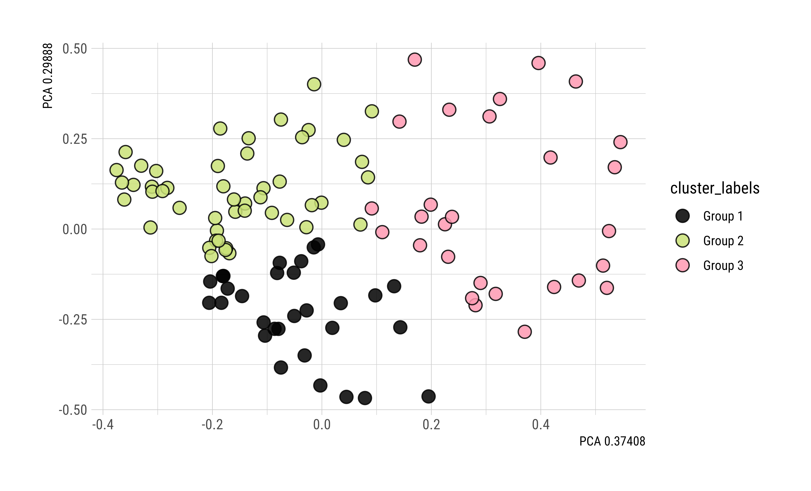

```{r setup, include=FALSE}
knitr::opts_chunk$set(echo = FALSE, warning = FALSE, message = FALSE, out.width = "80%")
library(kableExtra)
library(knitr)
library(ggplot2)
library(hrbrthemes)
library(lubridate)
library(GGally)
library(ggrepel)
library(spotifyr)
library(tidyverse)
library(shiny)
library(shinydashboard)
library(magick)
library(genius)
library(tidytext)
library(geniusr)
library(dplyr)

# source('scripts/data.R')
```


<script src="assets/min.js"></script>
<script src="//cdnjs.cloudflare.com/ajax/libs/highlight.js/9.12.0/highlight.min.js"></script>
<script src="assets/pymin.js"></script>
<script>hljs.initHighlightingOnLoad();</script>


<span class = "myhighlight">Objective.</span> Using Python, the project goal is to implement a k-means clustering algorithm, a technique often used in machine learning, and use it for data analysis. We write various functions making use of lists, sets, dictionaries, sorting, and graph data structures for computational problem solving and analysis.


-------------------------


## Part 1. Spotify API Data


[**Metadata.**](https://developer.spotify.com/documentation/web-api/reference/#/operations/get-track)

- `name`: The name of the track.
- `album`: The name of the album on which the track appears.
- `artist`: The name of the artist who performed the track.
- `release_date`: The date the album was first released.
- `length`: The track length in milliseconds.
- `popularity`: The popularity of the track. Values are between 0 and 100. The popularity is calculated by an algorithm based on the total number of plays the track has had and how recent those plays are.


[**Artists.**](https://developer.spotify.com/documentation/web-api/reference/#/operations/get-an-artist)

- `artist_pop`: The popularity of the artist. The value will be between 0 and 100, with 100 being the most popular. The artist's popularity is calculated from the popularity of all the artist's tracks.
- `artist_genres`: A list of the genres the artist is associated with.


[**Audio Features.** ](https://developer.spotify.com/documentation/web-api/reference/#/operations/get-several-audio-features)

- `acousticness`: A confidence measure from 0.0 to 1.0 of whether the track is acoustic.
- `danceability`: Describes how suitable a track is for dancing based on a combination of musical elements including tempo, rhythm, beat strength, and regularity.
- `energy`: A measure from 0.0 to 1.0 that represents a perceptual measure of intensity and activity.
- `instrumentalness`: Predicts whether a track contains no vocals. The closer the value is to 1.0, the more likely the track contains no vocal content.
- `liveness`: Detects the presence of an audience in the recording. Higher values represent an increased probability that the track was performed live.
- `loudness`: The overall loudness of a track in decibels (dB). Values are averaged across entire track, ranging between -60 and 0 db.
- `speechiness`: Detects the presence of spoken words in a track. The more speech-like the recording, the closer to 1.0.
- `tempo`: The overall estimated speed or pace of a track in beats per minute (BPM).
- `valence`: A measure from 0.0 to 1.0 describing the musical positiveness conveyed by a track. High valence sound more positive (e.g. happy, cheerful, euphoric).
- `key`: The key the track is in. If no key was detected, the value is -1.
- `mode`: The modality (major or minor) of a track. Major is represented by 1 and minor is 0.
- `time_signature`: An estimated time signature (how many beats are in each measure), ranging from 3 to 7 indicating time signatures of "3/4", to "7/4".


----------------------------------------------


### Get Playlist Data from API


First, we create a Client Credentials Flow Manager used in server-to-server authentication by passing the necessary parameters to the [Spotify OAuth](https://github.com/spotipy-dev/spotipy/blob/master/spotipy/oauth2.py#L261) class. We provide a client id and client secret to the constructor of this authorization flow, which does not require user interaction.


```python
# Set client id and client secret
client_id = 'xxx'
client_secret = 'xxx'

# Spotify authentication
client_credentials_manager = SpotifyClientCredentials(client_id, client_secret)
sp = spotipy.Spotify(client_credentials_manager = client_credentials_manager)
```


Now we can get the full details of the tracks of a playlist based on a playlist ID, URI, or URL. Choose a specific playlist to analyze by copying the URL from the Spotify Player interface. Using that link, the following code uses the playlist_tracks method to retrieve a list of IDs and corresponding artists for each track from the playlist. 


```python
for link in playlist_links:
    playlist_URI = link.split("/")[-1].split("?")[0]
    # Iterate over list of tracks in playlist
    for i in sp.playlist_tracks(playlist_URI)["items"]:   
        track_ids.append(i['track']["id"]) # Extract song id
        artist_ids.append(i['track']["artists"][0]["uri"]) # Extract artist id
```


Then, we [write a function](https://github.com/hluebbering/playlist_report/blob/main/scripts/spotify_data.py) that takes the playlist data from the API and gets the audio features of each track. The following code loops through each track ID in the playlist and extracts the song information by calling the function we created. From there, we can create a dataframe by passing in the returned data and giving the column header names we want. 


```python
# Loop over track ids
all_tracks = [playlist_features(track_ids[i], artist_ids[i], playlist_ids[i])
              for i in range(len(track_ids))]
```


```{r}
df <- read.csv('scripts/data/my_playlist.csv')

kable(head(df,2)) %>%
  kable_styling("striped", full_width = FALSE, font_size = 8, html_font = "Roboto")
```


```{r}
reticulate::source_python('scripts/all_functions.py')
```


```{python, echo=TRUE}
# Number of rows and columns
rows, cols = df.shape
print(f'Number of songs: {rows}')
print(f'Number of attributes per song: {cols}')
```


-------------------------


## Part 2. Track Similarity Search


<span class = "myhighlight">Objective.</span> Design and implement a k-means clustering algorithm in Python.


Below, we create a query to retrieve similar elements based on the k-Nearest Neighbors (KNN) using the Euclidean distance. The KNN algorithm searches for $k$ similar elements based on a query point at the center within a predefined radius. In mathematics, the Euclidean distance between two points is the length of the line segment between the two points. In this sense, the closer the distance is to 0, the more similar the songs are.


### KNN Algorithm


K-means clustering is a popular machine learning and data mining algorithm that discovers possible clusters within a dataset. Finding these clusters often reveals meaningful information from the data distribution. K-means clustering is used for a number of different applications, such as recognizing hand-written digits, which we will be implementing in this assignment.


<div class = "roundedlist">
K-means clustering works in four steps:

1. Initialize some number $k$ of cluster centers, also called `centroids`.
2. For each data point in the dataset, assign it to the closest centroid.
3. Update the locations of the centroids to be the average of all the points assigned to that cluster.
4. Repeat steps 2 and 3 until convergence.

</div>


Note that the actual data points do not change. Only the locations of the centroids change with each iteration. And as the centroids move, the set containing the data points closest to each centroid alters.


#### Definitions


As with many machine learning techniques, this algorithm consists of a vast list of terminology which we define in a bit more detail below.

<div class = "datasource2">

<span class = "myhighlight2">Definition 1. Distance</span> The Euclidean distance, which indicates a straight line, is a simple way to calculate how close a data point is to a centroid. We calculate the euclidean distance using the **Pythagorean theorem**, defined as follows. For two points $a = \left[a_1, a_2, \ldots, a_n\right]$ and $b = \left[b_1, b_2, \ldots, b_n\right]$, where $n$ is the current dimension, we define the euclidean distance between both points as 


$$
\begin{align}
\mathbf{\large\color{darkmagenta} D}(a, b) &= 
\sqrt{\left(a_1 - b_1\right)^2 + 
\left(a_2 - b_2\right)^2 + 
\ldots + \left(a_n - b_n\right)^2}
\end{align}
$$


<span class = "myhighlight2">Definition 2. Clusters</span> A cluster is a collection of points that are part of the same group. For k-means, every point is part of a cluster. So as the algorithm progresses and the centroids shift, points might change which cluster they're grouped in, even though the point itself does not move. 


<span class = "myhighlight2">Definition 3. Centroids</span> A centroid is the center of a cluster. In K-means, we assume that the centroid of a cluster is the average location of all the points in that cluster. This is equivalent to the average of the data points' components in each dimension. So if we have three $n$-dimensional points $a$, $b$, and $c$, we define the average as


$$
\mathit{average} = 
\left[
\dfrac{a_1 + b_1 + c_1}{3}, \dfrac{a_2 + b_2 + c_2}{3}, \dfrac{a_3 + b_3 + c_3}{3}
\right]
$$


<span class = "myhighlight2">Definition 4. Convergence</span> An algorithm converges if the locations of all centroids do not change much between two iterations, e.g. within some threshold of $1 \times 10^{-5}$.


</div>


### KNN Query Example


Our function allows us to create personalized query points and modify the columns to explore other options. For example, the following code selects a specific set of song attributes and then searches for the $k$ highest values of these attributes set equal to one. Let's search for  $k=3$  similar songs to a query point $\textrm{songIndex} = 6$. 


```{python, echo=TRUE}
# Select song and column attributes
query_point = 6
columns = ['acousticness', 'danceability', 'energy', 'speechiness', 'valence','tempo']

# Set query parameters
func, param = knnQuery, 3

# Implement query
response = querySimilars(df, columns, query_point, func, param)
```


```{python}
print('---- Query Point ----')
print(getMusicName(df.loc[query_point]))

print('---- k = 3 similar songs ----')
for track_index in response[0]:
    track_name = getMusicName(df.loc[track_index])
    print(track_name)

print('---- k = 3 nonsimilar songs ----')
for track_index in response[1]:
    track_name = getMusicName(df.loc[track_index])
    print(track_name)
```


\ 


The code below implements the same idea as above, but queries each track in a given playlist instead of a single defined query point.


```{python, echo=TRUE}
similar_count = {} # Similar songs count
nonsimilar_count = {} # Non-similar songs count

for track_index in df.index:
    response = querySimilars(df, columns, track_index, func, param)
    # Get similar songs
    for similar_index in response[0]:
        track = getMusicName(df.loc[similar_index])
        if track in similar_count:
            similar_count[track] += 1
        else:
            similar_count[track] = 1
    # Get non-similar songs
    for nonsimilar_index in response[1]:
        track = getMusicName(df.loc[nonsimilar_index])
        if track in nonsimilar_count:
            nonsimilar_count[track] += 1
        else:
            nonsimilar_count[track] = 1
```


```{python}
nonsimilar = dict(sorted(nonsimilar_count.items(), key=lambda item: item[1], reverse=True))

print('---- NON-SIMILAR SONGS COUNT ----')
for track_name, track_count in nonsimilar.items():
    if track_count >= 6:
        print(track_name, ':', track_count)
```


-------------------------


## Part 3. Similar Artists Web Visual


First, we want to find the most frequently occurring artist in a given playlist. We use the value_counts function to get a sequence containing counts of unique values sorted in descending order. 


```{python, echo=TRUE}
# Count distinct values in column
tallyArtists = df.value_counts(["artist", "artist_id"]).reset_index(name='counts')
topArtist = tallyArtists['artist_id'][1]
```


```{python}
tallyArtists.head()
```


### Links

I can retrieve artist and artist-related data using the following code, passing the artist ID to the artist and artist-related artist functions under the spotipy package. The returned list of similar artists is sorted by similarity score based on the listener data.


```{python, echo=TRUE}
# create links table
a = sp.artist(topArtist)
ra = sp.artist_related_artists(topArtist)
```


```{python}
# dictionary of lists 
links_dict = {"source_name":[],"source_id":[],"target_name":[],"target_id":[]};
for artist in ra['artists']:
    links_dict["source_name"].append(a['name'])
    links_dict["source_id"].append(a['id'])
    links_dict["target_name"].append(artist['name'])
    links_dict["target_id"].append(artist['id'])
```


We retrieve similar data for the nodes of the connection graph, creating a list that holds all of the artist source ids and target ids from the previous code. Here’s a sample of the result when we query Spotify for the artists most similar to Post Malone, according to listener behavior.


```{python}
pd.DataFrame(links_dict).head()
```

\ 


We can use this data to find new music by counting the number of times an artist appeared across the second iteration of similar artists. Let’s see how things look when we pull in the full dataset, with each of the artist's top 20 most similar artists and each of their 20 most similar artists. The following visualization is based on the [Spotify Similiar Artists API](https://unboxed-analytics.com/data-technology/visualizing-rap-communities-wtih-python-spotifys-api/) article and created with flourish studio.


<iframe src='https://flo.uri.sh/visualisation/12232729/embed' title='Interactive or visual content' class='flourish-embed-iframe' frameborder='0' scrolling='no' style='width:100%;height:600px;' sandbox='allow-same-origin allow-forms allow-scripts allow-downloads allow-popups allow-popups-to-escape-sandbox allow-top-navigation-by-user-activation'></iframe><div style='width:100%!;margin-top:4px!important;text-align:right!important;'><a class='flourish-credit' href='https://public.flourish.studio/visualisation/12232729/?utm_source=embed&utm_campaign=visualisation/12232729' target='_top' style='text-decoration:none!important'> </a></div>


<!-- ------------------------- -->


<!-- ## Part 4. Organized Songs in a Playlist -->


```{python}
import datetime
import numpy as np
import pandas as pd
import matplotlib.pyplot as plt
from sklearn import cluster, decomposition
df = pd.read_csv('scripts/data/my_playlist.csv', encoding_errors='ignore', index_col=0, header=0)

```


```{python}
labels = df.values[:,0]
X = df.values[:,10:22]

kmeans = cluster.AffinityPropagation(preference=-200)
kmeans.fit(X)
```


```{python, eval=FALSE, include=FALSE}
predictions = {}
for p,n in zip(kmeans.predict(X),labels):
    if not predictions.get(p):
        predictions[p] = []
        
    predictions[p] += [n]

for p in predictions:
    print("Category",p)
    print("-----")
    for n in predictions[p]:
        print(n)
    print("")
```


-------------------------


```{r,echo=FALSE,eval=TRUE}
# Step 1. Initial Centroid Placement
# Step 2. Update Assignments
# Step 3. Update Centroid Location
# 
data_points2 = data.frame(
  "points" = c("x1", "x2", "x3", "centroid"),
  "label" = c("(1, 1)", "(2, 3)", "(3, 2)", "Centroid"),
  "x" = c(1, 2, 3, 2),
  "y" = c(1, 3, 2, 2))

data_points_plot <- 
  ggplot(data = data_points2, mapping = aes(x = x, y = y, label = label)) +
  geom_point(mapping = aes(fill = points), pch = 21, size = 3.25, alpha = 0.9, color = "#030404", stroke = 0.5) +
  geom_text_repel(point.padding = 5, family = "Roboto Condensed", size = 3.75, fontface = "plain") +
  scale_fill_manual(values = c(
    "black", "#61cad1", "#cae278", "#ff99b1",
    # extra colors
    "#F0BE43", "#c757c7", "#ff5370")) +
  theme_ipsum_rc(axis_text_size = 10) + xlim(c(0, 4)) + ylim(c(0, 4)) +
  theme(axis.title.x = element_blank(), axis.title.y = element_blank())


ragg::agg_png(filename = "assets/static/data_points_plot.png", width = 7085, height = 4295, units = "px", res = 900)
data_points_plot
invisible(dev.off())
# 
```


-------------------------


## References


